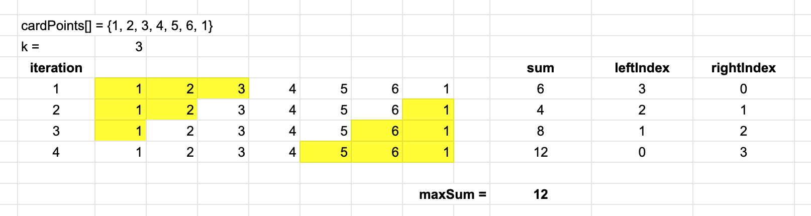

# Max Points from Cards

[Leet #1423](https://leetcode.com/problems/maximum-points-you-can-obtain-from-cards/) - Medium

## Topics

• Array     
• Minimum Subarray  
• Sliding Window    
• Google    

## Description

You are given an array of cards with points associated with each card.

For each step, you can take either the first card or the last card in the array.  You must take a total of `k` cards.

Return the maximum score that can be obtained.

## Sliding Window

There are a couple of approaches to solving this problem.

1. Think of a sliding window that can pick a total of _k_ cards, either from the left or right side of the cards array.

For instance, if k = 3, you could pick all 3 cards from the left side, all 3 cards from the right side, or 1 on the right and 2 on the left, or 2 on the left and 1 on the right.  The correct combination is the one that gives the highest sum of the selected cards.

2. Another way to solve the problem is calculate the minimum subarray of `n - k` cards.  The smallest `n - k` subarray will return the largest sum of `k` cards.

In the above example, the minimum subarray in iteration 4 totals 10.

## Conditions

1 <= k <= cardPoints.length

## Notes

I initially thought the problem asked to compare the left and right values of cardPoints[], pick the highest value, then add it to a maxSum.  After that, I would delete the value from cardPoints[], which would make the array one element smaller.  I then repeated the process _k_ times and returned maxSum.

This approach was not what the problem intended.

I also tried a recursive approach that was a modification of the above algorithm, but the tests did not pass.

## Status

Started:    January 2, 2022    
Completed:  January 5, 2022

